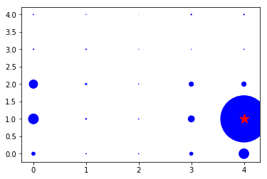

# iSDC_Python2DHistogram

2D Histogram Filter For SDC Localization Using Python 2.7

Project 001 of Udacity's "Intro To Self Driving Cars", Implementing A 2D Histogram Filter For SDC Localization Using Python 2.7. This project applies previously learned concepts for the lesson "Bayesian Thinking".
